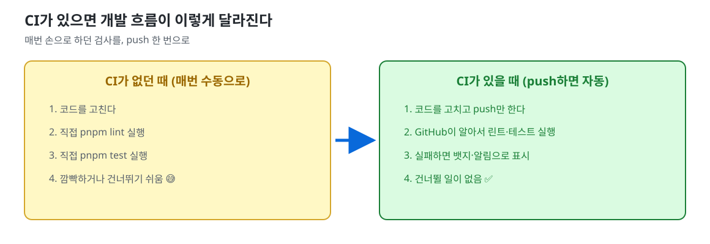
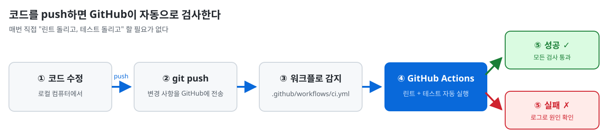
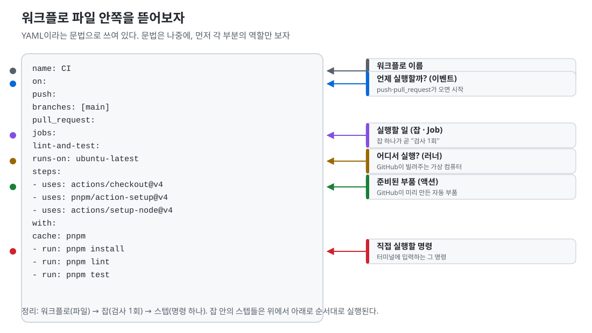
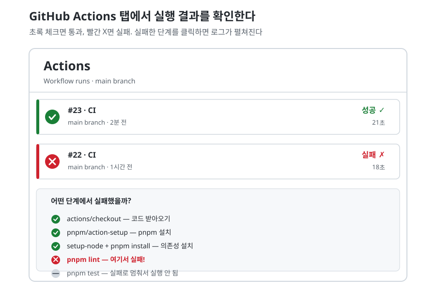

# GitHub Actions (CI) — GitHub이 대신 검사해주는 도구

<p align="center">
  
  
</p>

> **이 문서를 읽는 사람**: 개발을 이제 막 시작한 사람을 위한 문서다. "CI가 뭔지", "왜 필요한지", "우리 프로젝트에서 어떻게 설정하는지"를 다룬다. 파일 작성과 실행은 강의 중에 직접 해본다.

---

## 먼저, 준비물 (이전 강의)

이 문서는 **01-linter.md(ESLint)** 와 **02-testing.md(Vitest)** 를 먼저 마친 뒤에 본다.

우리 프로젝트에 두 가지 스크립트가 있어야 한다:

```bash
pnpm lint    # ← 01에서 만들었던 것
pnpm test    # ← 02에서 만들었던 것
```

CI는 이 두 명령을 **매번 push할 때마다 자동으로 실행**하게 해주는 도구다. 아직 `pnpm lint`나 `pnpm test`가 동작하지 않는다면, 먼저 01·02로 돌아가자.

---

## 한 문장 요약

> **CI**(지속적 통합, Continuous Integration) = **"코드를 GitHub에 올리면 자동으로 검사해서 합격/불합격을 알려주는 시스템"**이다.

> **GitHub Actions**(깃허브 액션즈) = GitHub에서 제공하는 CI 도구. "설계도(파일)"만 잘 적어두면 GitHub이 대신 실행해준다.

---

## 왜 필요한가요?



- **혼자 개발할 때**: 푸시할 때마다 린트·테스트가 자동으로 돈다. 실수를 GitHub이 먼저 발견해준다.
- **팀 개발할 때**: "내 컴퓨터에선 되는데?" 문제를 막아준다. 내가 다른 사람의 코드를 고쳤을 때, 그게 문제를 만들었는지 자동으로 알려준다.

핵심 가치: **"검사를 깜빡하는 일"이 사라진다.**

---

## CI가 정확히 뭐예요?



흐름을 한 번 보자:

1. 우리가 로컬 컴퓨터에서 코드를 고친다
2. `git push`로 GitHub에 올린다
3. GitHub이 `.github/workflows/` 폴더에 있는 워크플로 파일을 발견한다
4. GitHub Actions가 가상 컴퓨터를 빌려와서, 그 안에서 린트 + 테스트를 실행한다
5. 결과를 체크(✓) / 엑스(✗)로 알려준다

"지속적 통합(CI)"에서 **지속적(Continuous)** = 매번 올릴 때마다, **통합(Integration)** = 여러 사람의 코드가 한데 모이는 때. 즉 **"코드가 합쳐질 때마다 계속 검사한다"** 는 뜻이다.

---

## GitHub Actions 핵심 용어

| 용어 | 뜻 (비유) |
|------|-----------|
| **워크플로(Workflow)** | 자동화 절차 하나. `.github/workflows/` 폴더의 파일 하나 = 설계도 |
| **잡(Job)** | 워크플로 안의 실행 단위. "검사 1회" = 가상 컴퓨터 한 대에서 실행 |
| **스텝(Step)** | 잡 안의 작은 명령 하나. 위에서 아래로 순서대로 실행 |
| **러너(Runner)** | 실제로 명령을 실행해주는 가상 컴퓨터. GitHub이 무료로 빌려준다 |
| **이벤트(Event)** | 워크플로를 실행하게 만드는 계기. push, pull_request 등 |

> 💡 비유: **배달 로봇** —
> - 워크플로 = 배달 절차 전체 (설계도)
> - 잡 = "요리하기" + "배달하기" 같은 큰 구역
> - 스텝 = "재료 썰기" → "볶기" → "포장" 같은 한 동작
> - 러너 = 그 일을 실제로 하는 로봇
> - 이벤트 = "주문이 들어옴"

---

## 우리 프로젝트에서 어떻게 설정할까요? (3단계)

### 1단계: 워크플로 파일 만들기

프로젝트 폴더에 `.github/workflows/` 폴더를 만들고, 그 안에 `ci.yml`이라는 파일을 만든다.

```
fastcampus-intro/
└── .github/
    └── workflows/
        └── ci.yml   ← 이 파일이 설계도다
```

> 💡 `.github` 폴더는 GitHub이 특별히 보는 폴더다. Actions, 이슈 템플릿 같은 것들이 여기에 들어간다.

### 2단계: 파일 내용 살펴보기

워크플로 파일은 **YAML(야믈)** 이라는 문법으로 쓴다. 구조는 이렇게 생겼다:



핵심만 외우자:

| YAML 키워드 | 뜻 |
|-------------|-----|
| `name` | 워크플로 이름 (Actions 탭에 표시됨) |
| `on` | **언제** 실행할까 (이벤트) |
| `jobs` | **무엇을** 실행할까 |
| `runs-on` | **어디서** 실행할까 (러너 OS) |
| `steps` | 실행할 명령들 |
| `uses` | GitHub이 만들어둔 준비된 부품 (액션) |
| `run` | 직접 실행할 명령 |

### 3단계: push하면 Actions 탭에서 확인

파일을 커밋·푸시하면, GitHub 저장소의 **Actions** 탭에서 실행이 자동으로 시작된다.



- 초록 체크 ✓ → 모든 검사 통과
- 빨간 X ✗ → 실패. **어떤 단계에서 실패했는지** 보여주고, 클릭하면 상세 로그가 펼쳐진다

---

## 실제 파일 전문 (그대로 복사해도 되는 ci.yml)

```yaml
name: CI

on:
  push:
    branches: [main]
  pull_request:

jobs:
  lint-and-test:
    runs-on: ubuntu-latest
    steps:
      - uses: actions/checkout@v4          # 1. 코드 받아오기
      - uses: pnpm/action-setup@v4        # 2. pnpm 설치
        with:
          version: 11                     #    내 컴퓨터의 pnpm 버전에 맞추기
      - uses: actions/setup-node@v4       # 3. Node.js 설치
        with:
          node-version: 22                #    내 컴퓨터의 Node 버전에 맞추기
          cache: pnpm                     #    의존성을 캐시해서 더 빠르게
      - run: pnpm install                 # 4. 의존성 설치
      - run: pnpm lint                    # 5. 린트 검사
      - run: pnpm exec vitest run         # 6. 테스트 실행
```

> ⚠️ **테스트는 `vitest run`으로!** 02에서 배운 `vitest`(그냥 실행)는 **watch 모드**라서 "계속 기다리며" 멈추지 않는다. CI는 기다릴 시간이 없으니 `vitest run`(한 번만 실행)을 써야 한다. (`pnpm exec`는 "설치한 도구를 직접 부르기"다.)

---

## 버전을 맞추는 이유

`version: 11`, `node-version: 22`는 **러너 컴퓨터에 무엇을 설치할지** 정하는 값이다. 내 컴퓨터와 같게 맞춰야 "내 컴퓨터에선 됐는데 CI에선 왜 안 돼?"가 생기지 않는다. 확인 명령:

```bash
node -v    # 예: v22.23.2  →  node-version: 22
pnpm -v    # 예: 11.15.0   →  version: 11
```

---

## 뱃지 달기 (선택, 하면 멋있다)

README에 아래 마크다운을 붙이면, 저장소 위에 "CI가 통과 중"이라는 뱃지가 달린다:

```markdown
[](https://github.com/내아이디/저장소이름/actions/workflows/ci.yml)
```

`내아이디`와 `저장소이름`을 자기 것으로 바꾸면 된다. 예: `https://github.com/tmdgusya/fastcampus-intro/actions/...`

---

## 자주 만나는 실수 (트러블슈팅)

| 증상 | 원인 | 해결 |
|------|------|------|
| `pnpm: command not found` | pnpm 설치 스텝 누락 | `pnpm/action-setup` 스텝이 있는지 확인 |
| `No lint script` | `package.json`에 lint 스크립트 없음 | 01 강의를 따라 `pnpm lint`가 동작하는 상태로 |
| `vitest: not found` | 테스트 도구 미설치 | 02 강의를 따라 `pnpm test`가 동작하는 상태로 |
| CI가 멈춘다 (시간 초과) | 테스트가 watch 모드(`vitest`)로 실행됨 | `vitest run` 사용 |
| 러너에서만 안 되는 에러 | Node/pnpm 버전이 내 컴퓨터와 다름 | `node -v`, `pnpm -v`로 확인 후 맞추기 |
| 워크플로가 실행되지 않음 | 파일 위치·이름이 틀림 | `.github/workflows/ci.yml` 정확히 확인 |

---

## 알아두면 좋은 점

- **무료다**: 공개 저장소(public)는 Actions 실행 시간이 무료로 제공된다. 우리 저장소도 공개니까 걱정 없다.
- **로그를 읽는 연습**: 실패한 스텝을 클릭하면 상세 로그가 펼쳐진다. 에러 메시지를 읽는 게 디버깅의 시작이다.
- **수동 실행도 가능**: Actions 탭의 "Run workflow" 버튼으로 언제든 직접 실행할 수 있다.
- **이후 확장**: 지금은 린트+테스트뿐이지만, 나중에 빌드·배포도 이 파일에 한 줄씩 늘리면 된다.

---

## 참고 자료

- GitHub Actions 공식 가이드 (한국어 지원): https://docs.github.com/ko/actions
- 워크플로 문법 참고서: https://docs.github.com/ko/actions/reference/workflow-syntax-for-github-actions
- pnpm + GitHub Actions 공식 문서: https://pnpm.io/ko/continuous-integration

> 💡 Tip: 처음엔 공식 문서가 어렵다. 강의에서 같이 파일을 만들고 실행해본 뒤, "이 키워드는 뭐지?" 할 때만 공식 문서를 펼쳐보자.